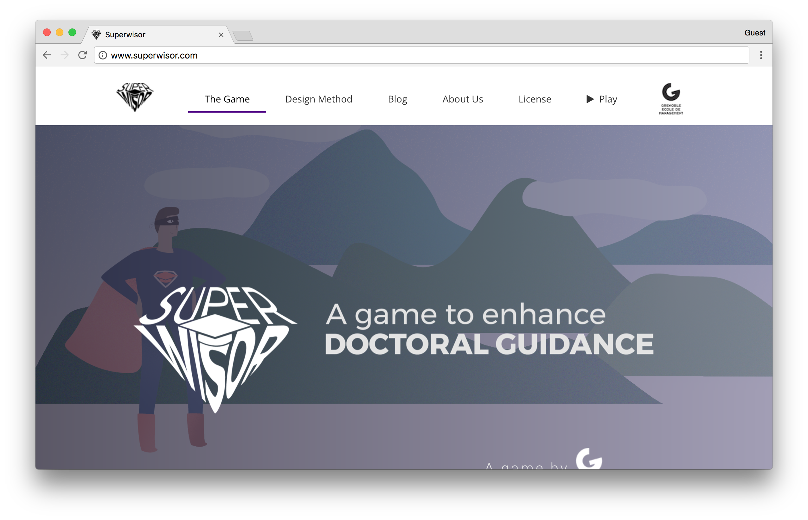

# Superwisor

Superwisor is a serious virtual game to enhance doctoral supervision. Supervisors play the game and go through three different senarios of interacting with their PhD or DBA student. At the end of the game, best practices and resources for improvement are shared with the supervisors.

The homepage for Superwisor was built with a [ThemeFisher's Airspace Jekyll themed template](https://github.com/luminousrubyist/airspace-jekyll).
